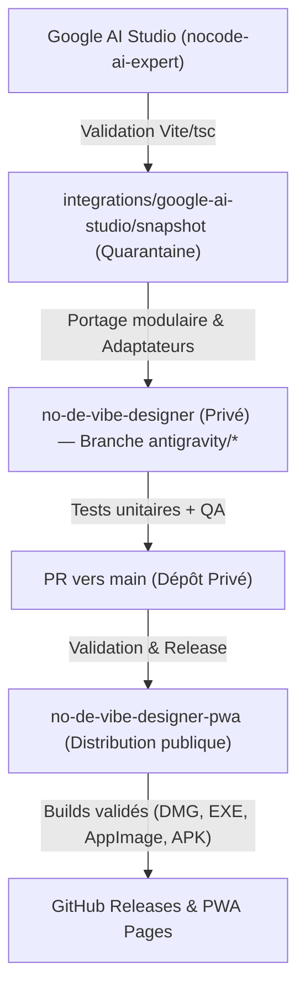

# Architecture Canonique & Protocole de Synchronisation Multi-Agents

Ce document régit la centralisation et la collaboration multi-agents entre les trois dépôts No[co]de Vibe Designer :
1. **`cdriccarboni/no-de-vibe-designer` (Privé)** — Dépôt source canonique complet (code source principal, Electron, Android Capacitor avec code natif Java, tests Playwright, bridges natifs, documentation).
2. **`cdriccarboni/no-de-vibe-designer-pwa` (Public)** — Dépôt de distribution et CI public (GitHub Pages, releases universelles macOS, Windows, Linux, Android debug APK, cache PWA).
3. **`cdriccarboni/nocode-ai-expert` (Public)** — Laboratoire expérimental Google AI Studio (React 19 / Vite 8 / TypeScript, prototypage Scénographe, cinématiques, shaders).

---

## 1. Rôles et Frontières de Confidentialité
- **Le dépôt privé `no-de-vibe-designer`** conserve les secrets, clés, configurations de signature, architecture complète et historique natif.
- **Le dépôt public `no-de-vibe-designer-pwa`** ne doit JAMAIS contenir de données privées, secrets de production ni AAB signés pour le Play Store.
- **Le laboratoire `nocode-ai-expert`** sert exclusivement à concevoir de nouveaux concepts visuels et algorithmiques. Son code ne remplace jamais directement les interfaces officielles.

---

## 2. Conventions de Branches par Agent
Chaque agent opère sur son propre préfixe de branches pour éviter tout conflit ou écrasement :
- **Google AI Studio** : `ai-studio/*` (ou snapshot via `integration/ai-studio-snapshot`)
- **Antigravity** : `antigravity/*`
- **Cursor** : `cursor/*`
- **ChatGPT** : `chatgpt/*`
- **Branches de staging & intégration** : `integration/*`
- **Branches de distribution** : `deploy/*`, `release/*`
- **Branche `main`** : Protégée, avance uniquement par Pull Request validée. Aucun force push (`--force`) n'est toléré.

---

## 3. Protocole d'Intégration et Anti-Boucle

### Règles d'or :
1. **Quarantaine obligatoire** : Tout snapshot d'AI Studio est placé dans `integrations/google-ai-studio/snapshot/` (privé) ou `labs/` (public).
2. **Adaptateurs idempotents** : Les modules portés (ex: `shared/scenic/scenic-adapter.js`) utilisent des IDs stables et ne touchent jamais aux éléments personnalisés de l'utilisateur.
3. **Pas de boucle de rétroaction** : Les dépôts de distribution ne ré-exportent jamais vers les dépôts amont sans passer par une PR de validation humaine ou un workflow d'intégration explicite.
